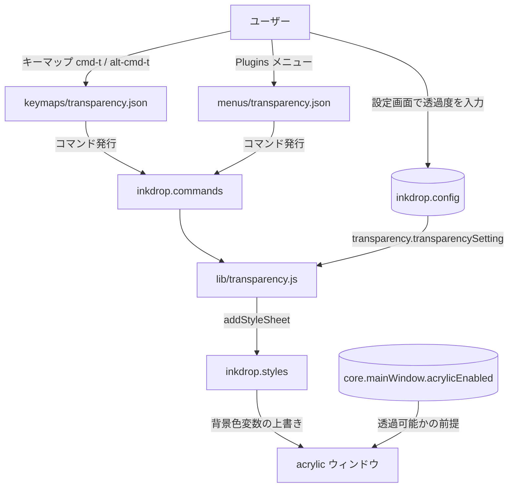
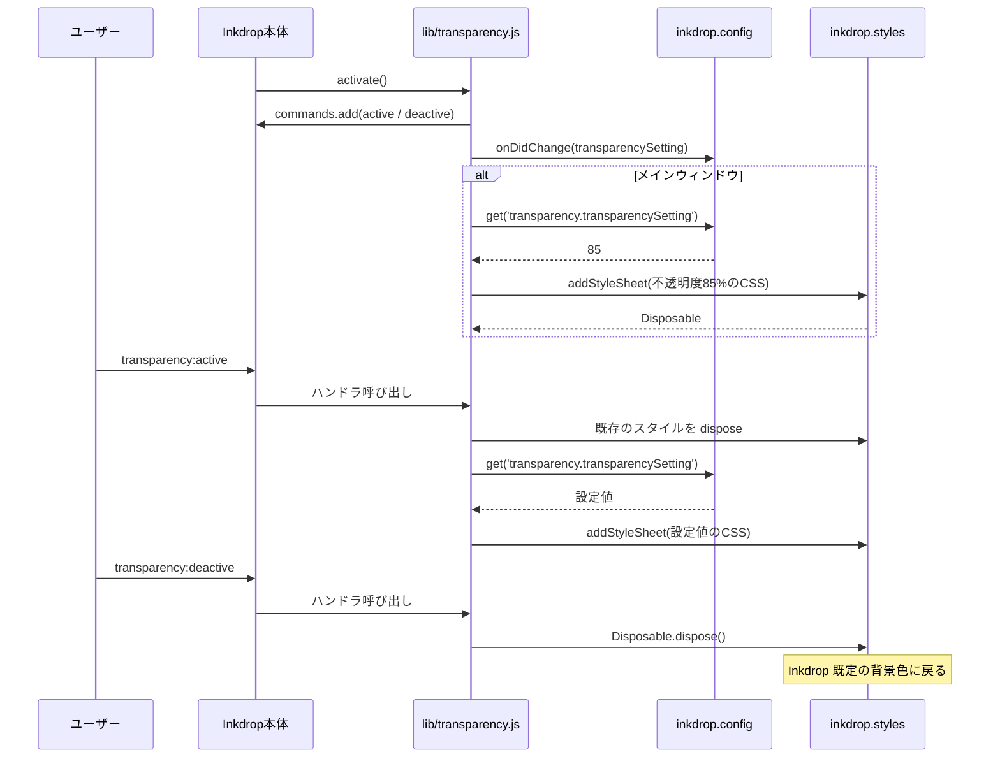

<!-- このファイルは docs/design-doc.md の一部です -->

# 設計概要: アーキテクチャ・データフロー

## 4. 設計概要

### アーキテクチャ図

### データフロー

### 主要コンポーネント

| コンポーネント             | 役割                                                           | 技術                         |
| -------------------------- | -------------------------------------------------------------- | ---------------------------- |
| `lib/transparency.js`      | 設定スキーマ定義、コマンド登録、スタイルシートの適用／解除     | JavaScript (CommonJS)        |
| `keymaps/transparency.json`| キーバインドとコマンドの対応付け                               | Inkdrop keymap 定義          |
| `menus/transparency.json`  | Plugins メニューへの項目追加                                   | Inkdrop menu 定義            |
| `inkdrop.config`           | 透過度設定値の保持と変更通知（設定画面のUIも自動生成される）   | Inkdrop API                  |
| `inkdrop.styles`           | スタイルシートの追加・削除（Disposable で解除）                | Inkdrop API (StyleManager)   |
| `inkdrop.notifications`    | acrylic 無効時の警告表示                                       | Inkdrop API                  |
