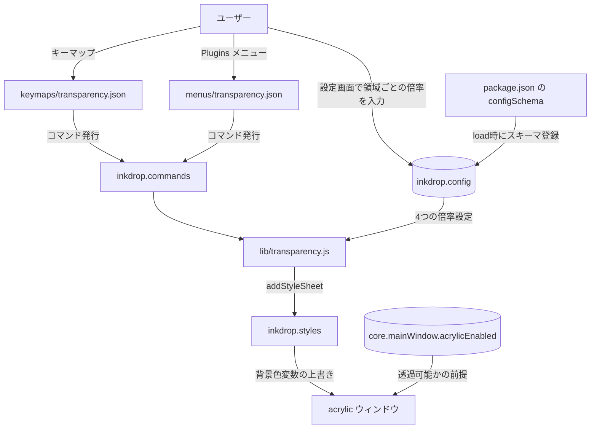
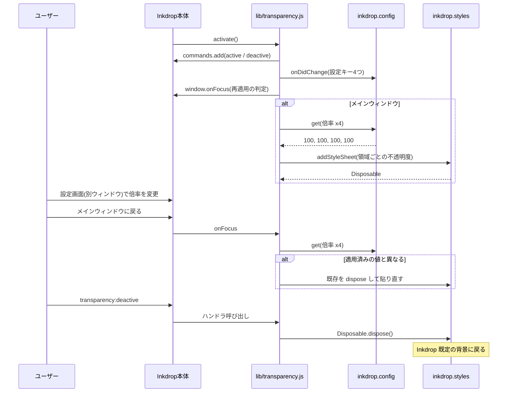

<!-- このファイルは docs/design-doc.md の一部です -->

# 設計概要: アーキテクチャ・データフロー

## 4. 設計概要

### アーキテクチャ図

### データフロー

### 主要コンポーネント

| コンポーネント              | 役割                                                           | 技術                       |
| --------------------------- | -------------------------------------------------------------- | -------------------------- |
| `lib/transparency.js`       | コマンド登録、スタイルシートの生成・適用・解除                 | JavaScript (CommonJS)      |
| `package.json` の `configSchema` | 設定スキーマの宣言（load 時に登録される）                 | Inkdrop パッケージ定義     |
| `keymaps/transparency.json` | キーバインドとコマンドの対応付け                               | Inkdrop keymap 定義        |
| `menus/transparency.json`   | Plugins メニューへの項目追加                                   | Inkdrop menu 定義          |
| `inkdrop.config`            | 倍率設定の保持と変更通知                                       | Inkdrop API                |
| `inkdrop.styles`            | スタイルシートの追加・削除（Disposable で解除）                | Inkdrop API (StyleManager) |
| `inkdrop.notifications`     | acrylic 無効時の警告表示                                       | Inkdrop API                |
